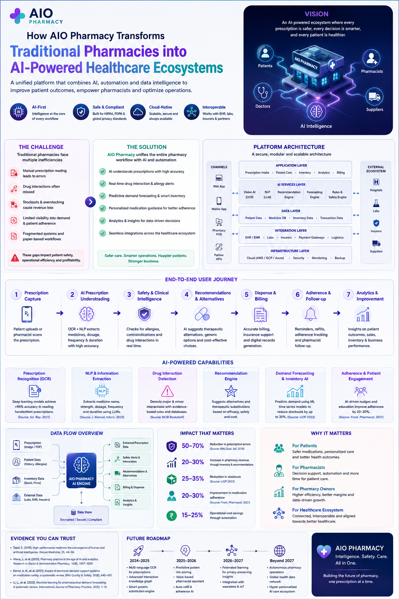
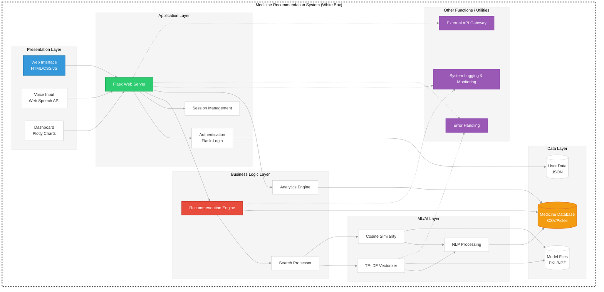
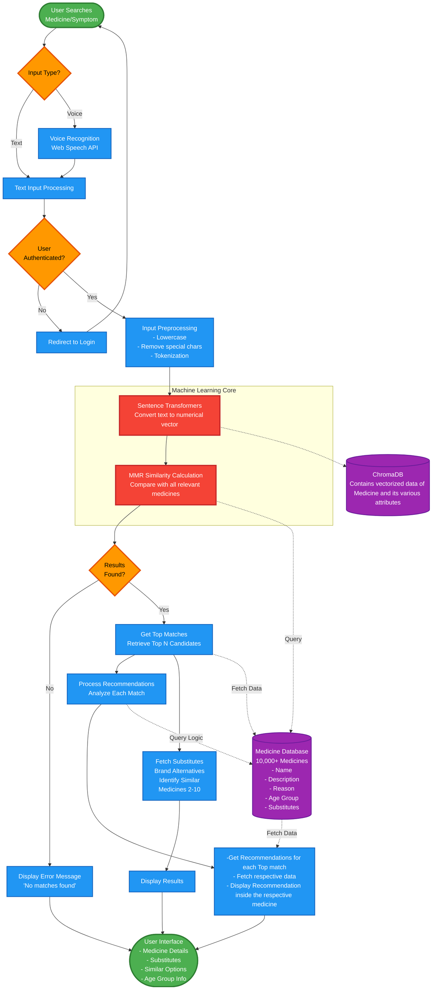
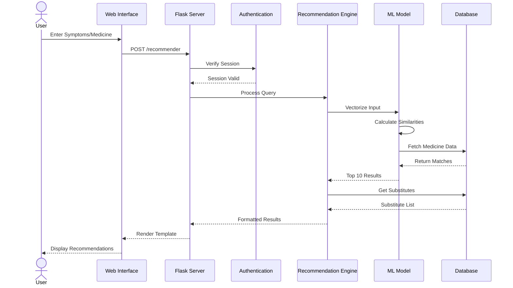
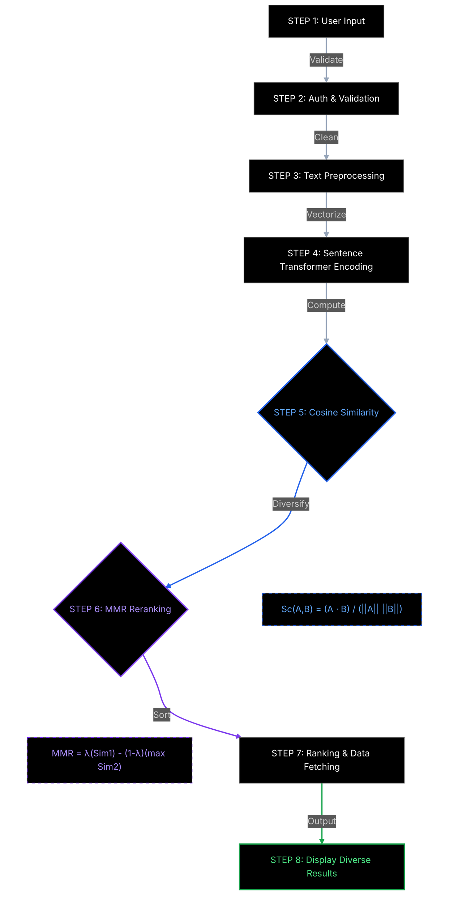
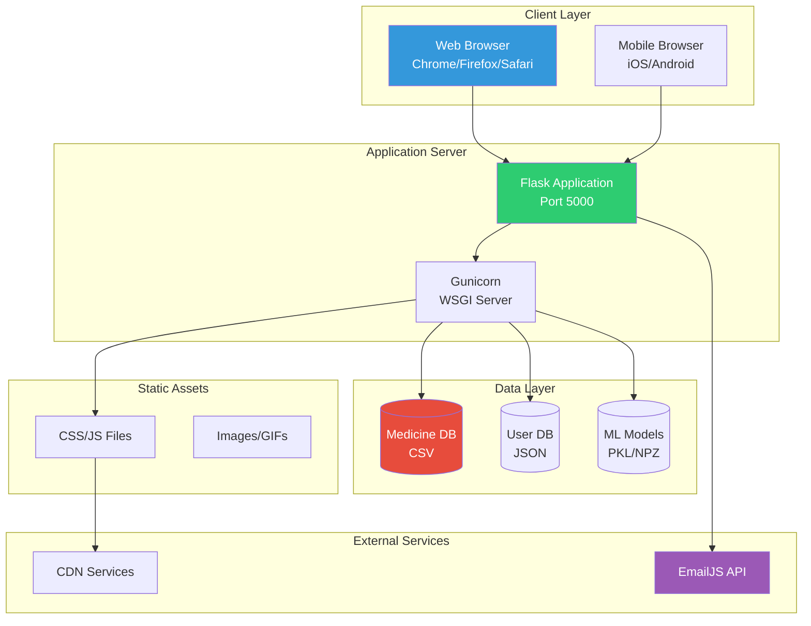

# AIOPharmacy 🏥💊

<div align="center">

### Intelligent Medicine Recommendation System Powered by AI

[](https://www.python.org/)
[](https://flask.palletsprojects.com/)
[](https://scikit-learn.org/)
[](LICENSE)

**[View Demo](https://huggingface.co/spaces/udityanarayan/AIOPharmacy) 
· [Report Bug](https://github.com/udityamerit/AIOPharmacy/issues) 
· [Request Feature](https://github.com/udityamerit/AIOPharmacy/issues)**

</div>

---

## 📑 Table of Contents

- [About The Project](#-about-the-project)
- [Key Features](#-key-features)
- [Technology Stack](#-technology-stack)
- [System Architecture](#-system-architecture)
- [Getting Started](#-getting-started)
- [Usage Guide](#-usage-guide)
- [API Documentation](#-api-documentation)
- [Project Structure](#-project-structure)
- [Machine Learning Model](#-machine-learning-model)
- [Contributing](#-contributing)
- [License](#-license)
- [Contact](#-contact)
- [Acknowledgments](#-acknowledgments)

---

## 🎯 About The Project

**AIOPharmacy** is an advanced, AI-powered medicine recommendation system designed to revolutionize how users discover and learn about medications. Built with cutting-edge Natural Language Processing (NLP) techniques, this platform analyzes symptoms, medicine names, and medical conditions to provide accurate, instant recommendations.

### 🌟 Vision

To democratize access to pharmaceutical information and empower individuals to make informed healthcare decisions through intelligent technology.

### 💡 Problem Statement

- **Information Overload**: Difficulty finding the right medicine among thousands of options
- **Symptom Matching**: Challenges in identifying appropriate medications based on symptoms
- **Alternative Discovery**: Limited knowledge about substitute medicines and brand alternatives
- **Accessibility**: Need for instant, reliable pharmaceutical information

### ✅ Solution

AIOPharmacy leverages **Sentence Transformer** and **Maximal Marginal Relevance (MMR) algorithms** to create an intelligent recommendation engine that:
- Matches symptoms to appropriate medications with high accuracy
- Provides comprehensive medicine information and alternatives
- Delivers instant results through an intuitive interface
- Offers voice-enabled search for enhanced accessibility

---


---

## 🚀 Key Features

### 🔍 **Intelligent Search Engine**
- **Symptom-Based Recommendations**: Enter symptoms like "fever and headache" to get relevant medicines
- **Medicine Name Search**: Find similar alternatives to any medication
- **Smart Matching Algorithm**: Uses NLP to understand context and provide accurate results


### 🎤 **Voice Recognition**
- **Speech-to-Text**: Speak your symptoms instead of typing
- **Real-Time Visualization**: Audio wave visualization during voice input
- **Multi-Language Support**: Recognizes multiple accents and dialects
- **Browser-Based**: No additional software required

### 📊 **Med Analyzer Dashboard**
- **Interactive Visualizations**: Dynamic Plotly charts (Pie & Bar)
- **Condition-Based Filtering**: Analyze medicines by medical conditions
- **Age Group Analysis**: View distribution across different age demographics
- **Statistical Insights**: Total medicine counts and detailed breakdowns

### 💊 **Comprehensive Medicine Database**
- **Detailed Information**: Name, description, usage, age groups
- **Brand Substitutes**: Up to 5 alternative brands per medicine
- **Similar Medicines**: Discover related medications
- **Regular Updates**: Expandable database structure

### 🔐 **Multi-Role Authentication**
- **Secure Login System**: Password hashing and session management
- **Role-Based Access**: Users, Pharmacists, Hospitals, Vendors
- **Persistent Storage**: JSON-based user data management
- **Session Security**: Flask-Login integration

### 📧 **Communication Platform**
- **Contact System**: EmailJS-powered messaging
- **User Feedback**: Direct communication channel
- **Support Integration**: Easy query submission

---

## 🛠️ Technology Stack

### **Backend & AI Technologies**

| Technology | Purpose | Version |
|------------|---------|---------|
|  | Core Language | 3.11+ |
|  | Web Framework & APIs | 2.0+ |
| **Gemini 2.5 Flash** | AI Clinical Analysis & RAG Agent | Google Generative AI |
| **LangChain** | AI Pipeline & RAG Orchestration | Latest |
| **ChromaDB** | Vector Database for Semantic Search | Latest |
| **Sentence Transformers** | Text Embeddings (`all-MiniLM-L6-v2`) | Latest |
|  | Data Analysis & Wrangling | Latest |
|  | Machine Learning Utilities | Latest |
| **Hugging Face Hub** | Dynamic Two-Way Database Synchronization | Latest |

### **Frontend & Visual Technologies**

| Technology | Purpose |
|------------|---------|
|  | Page Structure |
|  | Styling & Keyframe UI Animations |
|  | Form Interactivity & Map Logic |
| **Leaflet.js** | Interactive Maps & GPS Distance Finder (Dark Theme) |
|  | Dynamic Data Visualization Charts |

### **Libraries & External Services**
- **Web Speech API**: In-browser real-time voice-to-text transcription
- **Particles.js**: Custom animated interactive background nodes
- **EmailJS**: External client SMTP gateway messaging
- **Font Awesome**: Premium icon repository
- **Google Fonts**: Typography (Poppins & Outfit)

---

## 🏗️ System Architecture

### **High-Level Architecture**


---

### **Simplified Data Flow Architecture**


---

### **Component Interaction Diagram**



---

## **Data Flow Diagram**



---

## 🎬 Getting Started

### **Prerequisites**

Before you begin, ensure you have the following installed:

```bash
Python 3.8 or higher
pip (Python package installer)
Git
```

### **Installation**

Follow these steps to set up the project locally:

#### 1️⃣ **Clone the Repository**

```bash
git clone https://github.com/udityamerit/AIOPharmacy.git
cd AIOPharmacy
```

#### 2️⃣ **Create Virtual Environment** (Recommended)

```bash
# Windows
python -m venv venv
venv\Scripts\activate

# macOS/Linux
python3 -m venv venv
source venv/bin/activate
```

#### 3️⃣ **Install Dependencies**

```bash
pip install -r requirements.txt
```

#### 4️⃣ **Prepare Dataset**

Ensure the dataset is in the correct location:

```
AIOPharmacy/
└── Datasets/
    └── final_medicine_dataset_with_age_group.csv
```

#### 5️⃣ **Train the Machine Learning Model**

```bash
python train_model.py
```

**Expected Output:**
```
--- Starting Model Training ---
Step 1/4: Loading and preprocessing data...
Data loaded successfully.
Step 2/4: Training the NLP model (TfidfVectorizer)...
NLP model trained.
Step 3/4: Saving the vectorizer to tfidf_vectorizer.pkl...
Vectorizer saved.
Step 4/4: Saving the TF-IDF matrix to tfidf_matrix.npz and data to processed_data.pkl...
Matrix and data saved.

--- Training Complete! ---
```

#### 6️⃣ **Configure Application**

Update security settings in `app.py`:

```python
app.secret_key = 'your_unique_secret_key_here'
```

Update EmailJS credentials in `templates/contact.html`:

```javascript
emailjs.init("YOUR_EMAILJS_USER_ID");
const serviceID = 'YOUR_SERVICE_ID';
const templateID = 'YOUR_TEMPLATE_ID';
```

#### 7️⃣ **Run the Application**

```bash
python app.py
```

#### 8️⃣ **Access the Application**

Open your browser and navigate to:
```
http://localhost:5000
```

---

## 📖 Usage Guide

### **For End Users**

#### **1. Creating an Account**
1. Navigate to the login page
2. Select your role (User/Pharmacist/Hospital/Vendors)
3. Click "Sign Up" and enter credentials
4. You'll be automatically logged in


#### **2. Searching for Medicines**

**Method 1: Text Search**
```
1. Go to "Recommender" page
2. Type symptoms or medicine name
3. Click "Search" or press Enter
4. View top recommendation with alternatives
```

**Method 2: Voice Search**
```
1. Click the microphone icon
2. Speak your symptoms clearly
3. System automatically processes and searches
4. Results appear instantly
```

#### **3. Viewing Analytics**
```
1. Navigate to "Med Analyzer"
2. Select a medical condition from dropdown
3. Click "Analyze"
4. View total medicines and age distribution
5. Toggle between Pie and Bar charts
```

### **For Developers**

#### **Adding New Medicines**
Update your CSV file and retrain:
```bash
python train_model.py
```

#### **Adjusting Similarity Threshold**
Edit `recommender.py`:
```python
SIMILARITY_THRESHOLD = 0.1  # Increase for stricter matching
```

#### **Customizing UI**
Edit `static/style.css` for styling changes.

---

## 📡 API Documentation

### **Endpoints**

| Endpoint | Method | Auth | Description |
|----------|--------|------|-------------|
| `/` | GET | ❌ | Landing page |
| `/login` | GET, POST | ❌ | Authentication |
| `/logout` | GET | ✅ | User logout |
| `/recommender` | GET, POST | ✅ | Medicine search |
| `/medicines` | GET | ✅ | Browse medicines |
| `/medicines-showcase` | GET | ❌ | Public preview |
| `/dashboard` | GET, POST | ✅ | Analytics |
| `/contact` | GET | ✅ | Contact form |

### **Request Examples**

#### **Medicine Search (POST /recommender)**

```python
POST /recommender
Content-Type: application/x-www-form-urlencoded

query=fever+and+headache
```

**Response:**
```json
{
  "recommendation": {
    "name": "Paracetamol",
    "description": "Pain reliever and fever reducer",
    "reason": "Fever, Pain, Headache",
    "age_group": "Adult"
  },
  "substitutes": ["Crocin", "Dolo", "Calpol", "Tylenol"],
  "other_recommendations": [...]
}
```

---

## 📂 Project Structure

```
AIOPharmacy/
│
├── 📄 app.py                           # Main Flask application
├── 📄 recommender.py                   # ML recommendation engine
├── 📄 train_model.py                   # Model training script
├── 📄 requirements.txt                 # Python dependencies
├── 📄 README.md                        # Project documentation
├── 📄 LICENSE                          # MIT License
│
├── 📁 Datasets/
│   └── final_medicine_dataset_with_age_group.csv
│
├── 📁 static/                          # Static assets
│   ├── style.css                       # Main stylesheet
│   └── scanning.gif                    # Search animation
│
├── 📁 templates/                       # HTML templates
│   ├── base.html                       # Base template
│   ├── home.html                       # Landing page
│   ├── login.html                      # Authentication
│   ├── index.html                      # Recommender interface
│   ├── dashboard.html                  # Analytics dashboard
│   ├── medicines.html                  # Medicine catalog
│   ├── medicines_showcase.html         # Public preview
│   └── contact.html                    # Contact form
│
├── 📁 Model Files/ (Generated)
│   ├── tfidf_vectorizer.pkl           # Trained vectorizer
│   ├── tfidf_matrix.npz               # TF-IDF matrix
│   └── processed_data.pkl             # Processed dataset
│
└── 📄 users.json (Generated)          # User data storage
```

---

## 🔄 How AIOPharmacy Works

### **Simple 3-Step Process**

```
🔍 SEARCH → 🤖 AI ANALYSIS → 💊 RESULTS
```

#### **For Users (Simple Explanation)**

1. **You Search**: Type symptoms like "fever and headache" or a medicine name
2. **AI Analyzes**: Our smart system compares your input with 10,000+ medicines
3. **You Get Results**: Best matches with alternatives and detailed information

#### **Behind the Scenes (Technical)**


### **Real-World Example**

**Scenario**: User searches for "pain and inflammation"

```
INPUT: "pain and inflammation"
  ↓
PREPROCESSING: Convert to vector representation
  ↓
ANALYSIS: Compare with medicine database
  ↓
MATCHING:
  • Ibuprofen (88% match) ✓
  • Diclofenac (85% match) ✓
  • Aspirin (82% match) ✓
  ↓
OUTPUT: Display top medicine with 5 brand alternatives
```

### **Why This Approach?**

| Traditional Search | AIOPharmacy AI |
|-------------------|----------------|
| Exact keyword matching | Intelligent context understanding |
| Limited results | Multiple alternatives |
| No similarity detection | Finds similar medicines |
| Manual filtering needed | Auto-ranked by relevance |

---

## 🧠 Machine Learning Model

### **Core Algorithm: Sentence Transformers**
Unlike traditional keyword matching (TF-IDF), **AIOPharmacy** utilizes **Sentence Transformers (Bi-Encoders)** to achieve deep semantic understanding. This architecture is optimized for retrieval tasks where speed and context are critical.

* **Deep Semantic Mapping**: Symptoms are converted into **384-dimensional dense vectors**.
* **Contextual Awareness**: The model understands that *"throbbing head"* is semantically similar to *"headache"*, even if the words don't match exactly.
* **Pre-trained Excellence**: Uses the `all-MiniLM-L6-v2` model, optimized for speed and accuracy in real-time pharmaceutical applications.


---

### **Metric: Cosine Similarity**
To determine how closely a user's symptoms match a medication in our database, we calculate the cosine of the angle between their respective vectors.

**Mathematical Formula:**

$$
S_c(A,B) = \cos(\theta) = \frac{A \cdot B}{\|A\| \|B\|} = \frac{\sum_{i=1}^{n} A_i B_i}{\sqrt{\sum_{i=1}^{n} A_i^2} \sqrt{\sum_{i=1}^{n} B_i^2}}
$$

* **Range**: $0$ to $1$ (for non-negative vectors like embeddings).
* **Interpretation**: A score of $1.0$ indicates identical semantic meaning, while $0$ indicates no relation.


---

### **Diversification: Maximal Marginal Relevance (MMR)**
Standard similarity searches often result in redundancy (e.g., showing 10 different brands of Paracetamol). We solve this by implementing the **MMR Algorithm**, which re-ranks results to balance relevance with diversity.

**The MMR Formula:**

$$
MMR = \arg \max_{D_i \in R \setminus S} \left[ \lambda \cdot \text{Sim}(D_i, Q) - (1 - \lambda) \cdot \max_{D_j \in S} \text{Sim}(D_i, D_j) \right]
$$

* **Relevance ($\lambda$):** How well the medicine ($D_i$) matches the query ($Q$).
* **Diversity ($1-\lambda$):** How different the medicine is from those already selected ($S$).
* **Balance:** We set $\lambda = 0.5$ to ensure users receive a diverse list of treatments (e.g., an analgesic, an anti-inflammatory, and a combination drug) rather than repetitive brands.


---

### **Implementation Details**

#### **1. Data Preprocessing**
```python
from sentence_transformers import SentenceTransformer

# Create semantic "soup" by combining relevant metadata
df['soup'] = df['name'] + ' ' + df['description'] + ' ' + df['reason']

# Initialize the Transformer model
model = SentenceTransformer('all-MiniLM-L6-v2')

# Generate dense embeddings for the entire database
medicine_embeddings = model.encode(df['soup'].tolist(), show_progress_bar=True)

```

#### **2. Recommendation Process (MMR Function)**

```python
import numpy as np
from sklearn.metrics.pairwise import cosine_similarity

def apply_mmr(query_embedding, document_embeddings, lambda_param=0.5, top_k=10):
    """
    Calculates Maximal Marginal Relevance for diverse medicine recommendation.
    """
    # 1. Calculate cosine similarity between query and all docs
    query_sims = cosine_similarity(query_embedding, document_embeddings)[0]
    
    selected_indices = []
    remaining_indices = list(range(len(document_embeddings)))
    
    # 2. Start with the single most relevant document
    first_idx = np.argmax(query_sims)
    selected_indices.append(first_idx)
    remaining_indices.remove(first_idx)
    
    # 3. Iteratively select the next best candidate that maximizes MMR
    while len(selected_indices) < top_k:
        mmr_scores = []
        for i in remaining_indices:
            # Relevance term
            relevance = query_sims[i]
            
            # Diversity term: Max similarity to any already-selected item
            redundancy = max([cosine_similarity([document_embeddings[i]], 
                             [document_embeddings[j]])[0][0] for j in selected_indices])
            
            # Combined MMR Score
            score = lambda_param * relevance - (1 - lambda_param) * redundancy
            mmr_scores.append((i, score))
        
        # Select item with highest MMR score
        next_best = max(mmr_scores, key=lambda x: x[1])[0]
        selected_indices.append(next_best)
        remaining_indices.remove(next_best)
        
    return selected_indices

```

---

### **Why Sentence Transformers + MMR?**

| Feature | Traditional TF-IDF | AIOPharmacy (Transformer + MMR) |
| --- | --- | --- |
| **Logic** | Exact Word Overlap | Semantic Intent & Meaning |
| **Variety** | Redundant (Shows same salt) | Diverse (Shows different salts/classes) |
| **Context** | Fails on "feeling hot" | Maps "feeling hot" to "fever" |
| **Search Type** | Keyword-based | Context-aware Semantic Search |

---
### **Deployment Architecture**




## 🤝 Contributing

Contributions make the open-source community an amazing place to learn, inspire, and create. Any contributions you make are **greatly appreciated**.

### **How to Contribute**

1. **Fork the Project**
2. **Create your Feature Branch**
   ```bash
   git checkout -b feature/AmazingFeature
   ```
3. **Commit your Changes**
   ```bash
   git commit -m 'Add some AmazingFeature'
   ```
4. **Push to the Branch**
   ```bash
   git push origin feature/AmazingFeature
   ```
5. **Open a Pull Request**

### **Contribution Guidelines**

- Follow PEP 8 style guide for Python code
- Write clear, descriptive commit messages
- Add comments for complex logic
- Update documentation for new features
- Test thoroughly before submitting PR

### **Code of Conduct**

Please read our [Code of Conduct](CODE_OF_CONDUCT.md) before contributing.

---

## 📄 License

Distributed under the MIT License. See `LICENSE` file for more information.

```
MIT License

Copyright (c) 2024 Uditya Narayan Tiwari

Permission is hereby granted, free of charge, to any person obtaining a copy
of this software and associated documentation files (the "Software"), to deal
in the Software without restriction, including without limitation the rights
to use, copy, modify, merge, publish, distribute, sublicense, and/or sell
copies of the Software, and to permit persons to whom the Software is
furnished to do so, subject to the following conditions:

The above copyright notice and this permission notice shall be included in all
copies or substantial portions of the Software.
```

---

## 👤 Contact

**Uditya Narayan Tiwari**

[](https://www.linkedin.com/in/uditya-narayan-tiwari-562332289/)
[](https://github.com/udityamerit)
[](mailto:your.email@example.com)

**Project Link**: [https://github.com/udityamerit/AIOPharmacy](https://github.com/udityamerit/AIOPharmacy)

---

## Acknowledgments

### **Inspiration & Resources**
- [Flask Documentation](https://flask.palletsprojects.com/)
- [Scikit-learn Documentation](https://scikit-learn.org/)
- [Plotly Documentation](https://plotly.com/python/)
- [Web Speech API](https://developer.mozilla.org/en-US/docs/Web/API/Web_Speech_API)

### **Special Thanks**
- Open-source community for amazing libraries
- Medical professionals for domain knowledge
- Beta testers for valuable feedback

### **Libraries & Tools**
- Particles.js for background animations
- Font Awesome for icons
- Google Fonts for typography
- EmailJS for email integration

---

## ⚠️ Disclaimer

**IMPORTANT MEDICAL DISCLAIMER:**

This application is designed for **educational and informational purposes only**. The medicine recommendations provided by AIOPharmacy should NOT be considered as professional medical advice, diagnosis, or treatment.

**Key Points:**
- ✋ Always consult qualified healthcare professionals before taking any medication
- 🏥 Never replace professional medical consultation with application recommendations
- 💊 Medication effects vary by individual health conditions
- ⚕️ Self-medication can be dangerous without proper medical supervision
- 📞 In case of medical emergency, contact emergency services immediately

**By using this application, you acknowledge that:**
1. The recommendations are algorithmically generated
2. They may not account for drug interactions or allergies
3. You take full responsibility for any medical decisions
4. The developers are not liable for any health consequences

**For Medical Emergencies:** Call your local emergency number immediately.

---

## 📊 Project Statistics


---

<div align="center">

### ⭐ Star this repository if you find it helpful!

**Made with ❤️ by Uditya Narayan Tiwari And Teams**


[Back to Top](#aiopharmacy-)

</div>
